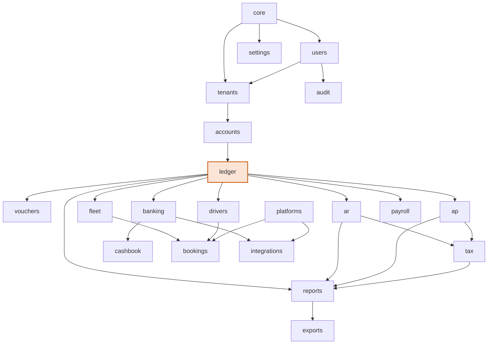
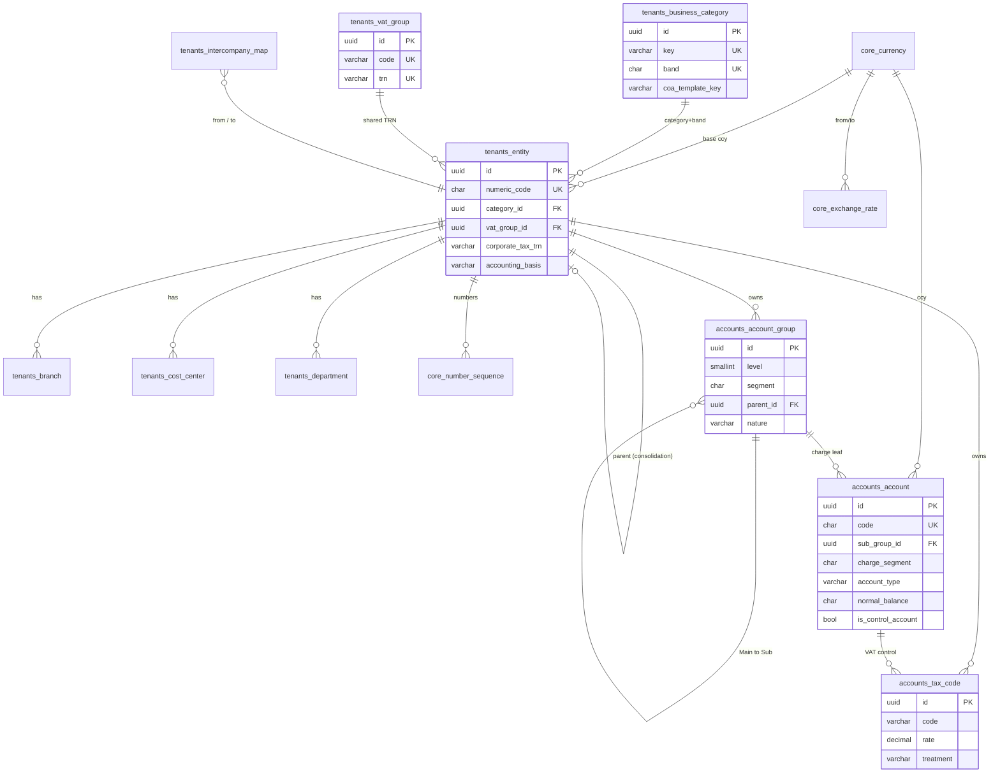
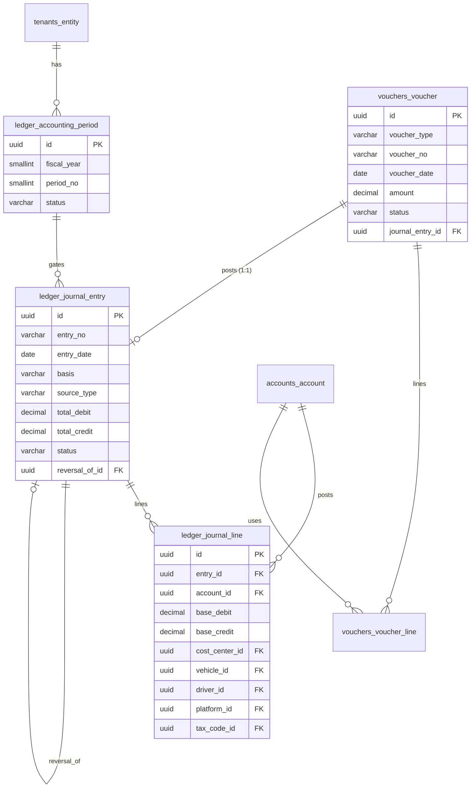
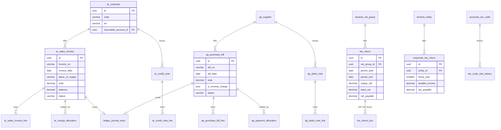
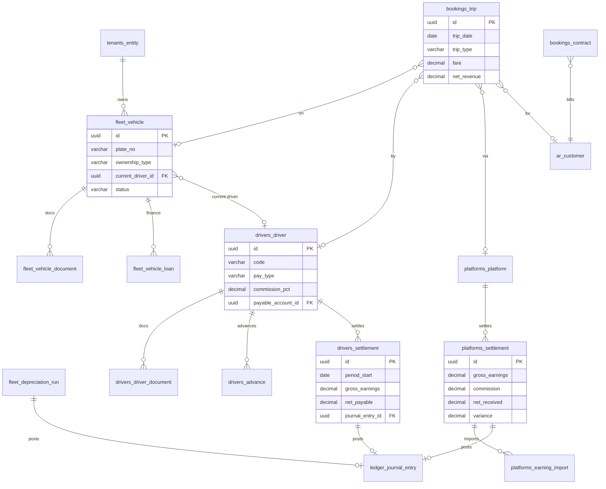
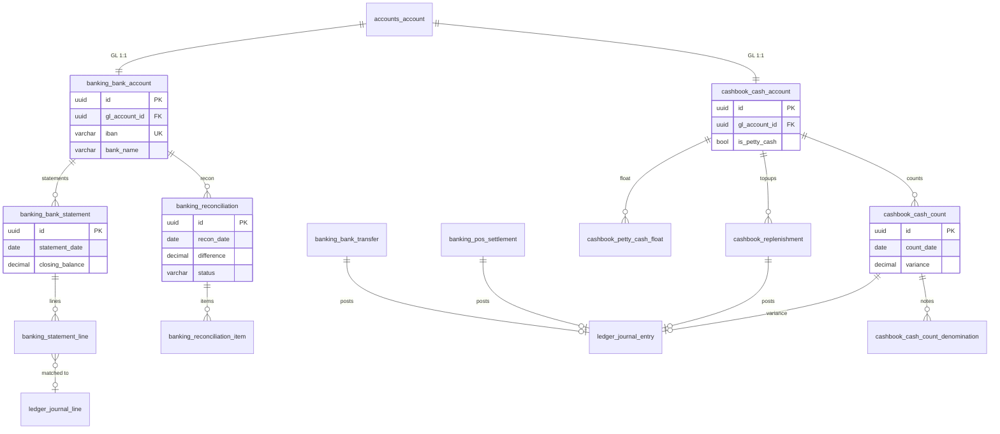
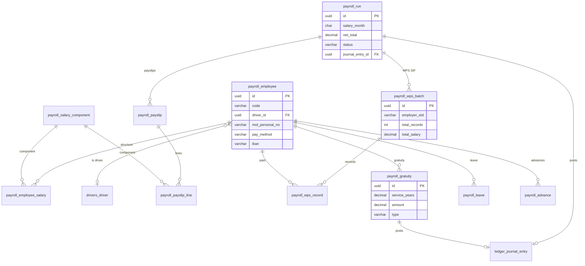
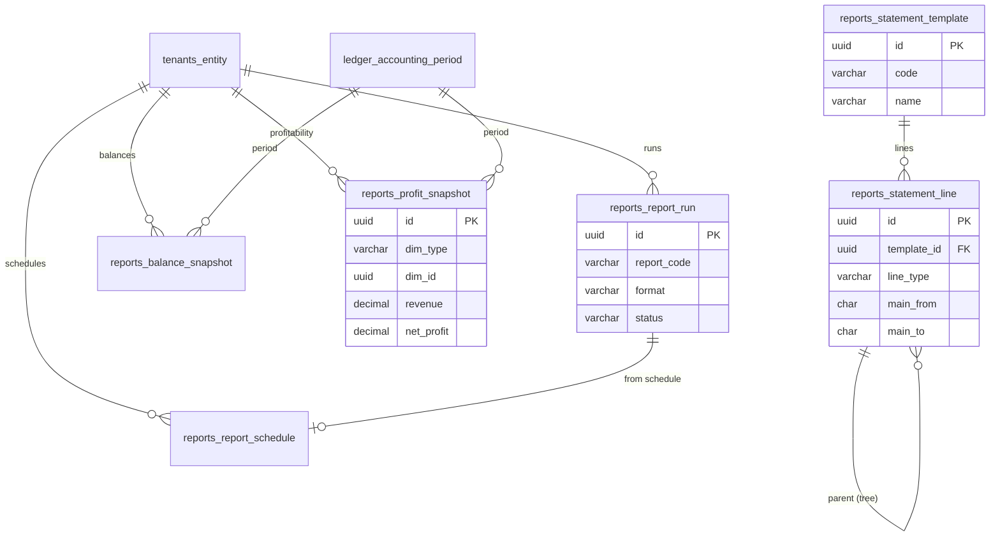

# FinCare — ERD Diagrams

Visual entity-relationship diagrams for the Phase-1 schema, grouped by domain
(matching design docs 01–07). Mermaid renders on GitHub and in most Markdown
viewers. Each diagram shows primary keys (PK), unique keys (UK), and the key
foreign keys (FK); full columns are in the design docs and `DATA_DICTIONARY.md`,
all relationships in `FinCare_Relationships.xlsx`.

Crow's-foot reading: `||--o{` = one-to-many (parent to child); `||--o|` =
one-to-(zero/one); `}o--||` = many-to-one.

---

## 0. Module overview

How the apps depend on one another. Everything monetary posts through `ledger`
(ADR-0007).

---

## 1. Core · Tenants · Accounts (doc 01)

---

## 2. Ledger · Vouchers — the posting engine (doc 02)

---

## 3. AR · AP · Tax (doc 03)

---

## 4. Fleet · Drivers · Platforms · Bookings (doc 04)

---

## 5. Banking · Cashbook (doc 06)

---

## 6. Payroll · WPS (doc 07)

---

## 7. Reports (doc 05)

---

> These diagrams are domain views; cross-domain FKs (e.g. every transactional
> table → `tenants_entity`, every posting line → `accounts_account`,
> document → `ledger_journal_entry`) are summarised here and listed in full in
> `FinCare_Relationships.xlsx`.
